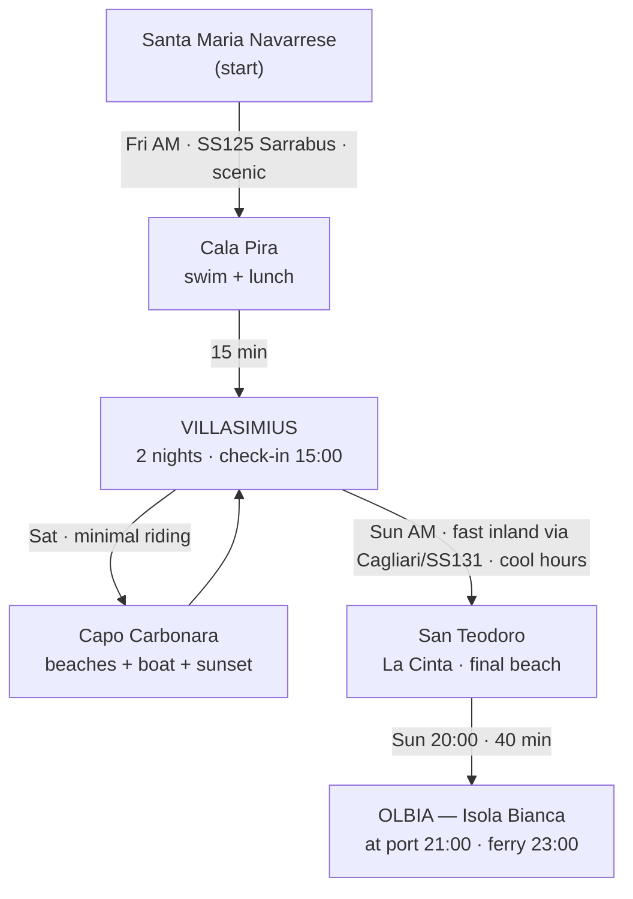

# Sardinia — The Final Three Days 🏝️🏍️

**A couple, one motorcycle, and the best possible ending to a Sardinian holiday.**

| | |
|---|---|
| **Start** | Santa Maria Navarrese (Ogliastra, east coast) |
| **Day 1 — Fri 17 Jul** | Ride south to **Villasimius** (hotel check-in 15:00) |
| **Day 2 — Sat 18 Jul** | Full relaxing day around **Capo Carbonara / Villasimius** |
| **Day 3 — Sun 19 Jul** | Transfer north, final beach, **Olbia** ferry (board 23:00, at port ~21:00) |
| **Guiding rule** | Enjoy Sardinia. The bike is transport, not the point. Ride cool mornings, swim through the hot hours, never rush the ferry. |

> **Heads-up that shaped the whole plan:** since June 2026, **Punta Molentis is booking-only** (150 people / 70 cars per day, €10, reserve by midnight the night before at `pass.brav.it/Villasimius`). And **Villasimius → Olbia is 263 km / ~3h40** on the fast road — there is *no* version of Sunday where you leisurely beach in Villasimius all morning, ride the scenic coast, and still catch a 23:00 ferry relaxed. Those two facts drive the decisions below.

---

## 1. The Expert Round-Table (they argue first, agree later)

### 🧭 Local Sardinian Expert
- The **SS125 through the Sarrabus mountains** (Tortolì → Muravera) is one of the great roads of the island — cork oaks, empty curves, the Sette Fratelli massif. You *have* to make this transfer anyway, so take the beautiful version. This is the one place "riding" earns its keep.
- Forget the postcard fights. **Punta Molentis** is a jewel but in 2026 it's a ticketed fishbowl. What locals actually do around Villasimius: swim at **Cala Pira** (junipers, a Spanish watchtower, shade), take a **boat into the Capo Carbonara marine reserve** (Isola dei Cavoli), and eat where the harbour tourists don't.
- **Costa Rei** is genuinely lovely but it's an 8 km exposed windy strand built for families and kite-surfers — not a couple hunting coves. *Challenge to the Beach Expert: don't burn a half-day there.*
- On the plate: you're leaving **Ogliastra**, the home of **culurgiones** (pleated potato-mint-pecorino dumplings). Eat them before you go south — you won't find them better anywhere.

### 🏖️ Beach & Relaxation Expert
- Agreed on Cala Pira over Costa Rei for Day 1 — but I'll defend a *five-minute photo stop* at Costa Rei's **Scoglio di Peppino** if you pass it. That's it.
- Day 2's anchor is **Porto Giunco**: Caribbean sand, a flamingo lagoon behind it, and the **promontory viewpoint** that is the best free panorama in the southeast. Pair it with the shadier **Cala Caterina / Cala Cipolla** for the afternoon.
- **Challenge to the Local Expert:** the marine-reserve boat trip is gorgeous but it's a *commitment* — 4 hours, a schedule, a booking. For a couple whose stated priority is "relaxing, not rushing," I'd make it optional, not the spine of the day.
- Hidden coves are stunning but come with **no shade and no facilities**. If you chase them, you carry your own umbrella and water. Say so plainly.
- Final day: the only sane "beach" is one **near Olbia** — **La Cinta / Cala Brandinchi at San Teodoro**. Do the boring ride early, be horizontal by noon.

### 🛵 Logistics Expert (the one who says no)
- **Day 1 is easy** — only ~110 km, but the Sarrabus is twisty and slow. Leave by **08:00**, fuel in **Tortolì before the mountains** (thin on stations after), be at the coast by ~11:30. Beach *before* check-in, because 15:00 is the earliest you can get the room anyway.
- **Day 3 is the whole ballgame.** 263 km to Olbia. **Challenge to everyone romanticising the coastal SS125 north:** that route is 5+ hours, it *retraces* Friday's Sarrabus twisties, and it puts you on a hot mountain road at 15:00 with a ferry deadline. Veto. Take the **efficient inland route** in the cool morning and spend the heat on a beach that's already near the port.
- **Ferry maths:** summer vehicle check-in closes **90 minutes** before departure and they ask vehicles to report **2 hours** early. 23:00 sailing → be at **Isola Bianca by ~21:00**. Your instinct is correct; build the day backwards from it.
- **Punta Molentis:** motorbikes still count against the 70-vehicle cap and you must book the night before. Honestly? For one day, skip the admin — Porto Giunco needs no ticket.

### 🍽️ Food Expert
- **Don't eat at the tourist harbour by default.** Villasimius has good food if you pick and *book* — Saturday night in mid-July, walk-ins wait an hour.
- Seek: **fregola con arselle/vongole** (clam-studded toasted pasta), **spaghetti alla bottarga**, grilled **catch of the day**, **culurgiones** (Day 1, Ogliastra), and **seadas** (fried pastry, pecorino, bitter honey) to finish. Gelato daily; that's non-negotiable.
- **Book Saturday dinner now.** Everything else can be spontaneous.
- **Challenge to the Logistics Expert:** don't cram Sunday dinner into a 20-minute pit stop. Make it an **early aperitivo-dinner in San Teodoro at ~18:30**, then roll to the port full and calm.

### 🔎 Experience Reviewer (Critic) — first pass
- The draft everyone's circling is **80% right**. Three fixes:
  1. **No beach-hopping by motorcycle in peak heat.** One anchor per session. Gearing up in 38°C to move 4 km is misery. Pick a spot, stay.
  2. **Kill the "scenic coastal route to Olbia" fantasy.** It's the single biggest stress risk in the trip. The inland transfer isn't a compromise — it's the *feature* that buys you a relaxed final swim.
  3. **Watch the luggage.** Day 1 you swim with panniers on the bike. Park in sight, take valuables to the towel, don't stress — but plan for it.
- Missed opportunity to *add*: the **Porto Giunco promontory at golden hour** and **Fortezza Vecchia** — five minutes of walking for the best photos of the trip.

---

## 2. The Debates, Resolved

**Q: Stop between Santa Maria and Villasimius, or ride direct?**
→ **Stop — once.** The Sarrabus SS125 is the scenic reward, and a midday swim + lunch at **Cala Pira** lands exactly in the hot-hours window before a 15:00 check-in. Don't *also* do Costa Rei; one stop, done well.

**Q: Which Villasimius beaches are worth several hours?**
→ **Porto Giunco** (morning, the icon) and **Cala Caterina / Cala Cipolla** (afternoon shade). Both reward a long stay. Skip the beach-hop.

**Q: Are hidden beaches better than the famous ones?**
→ **Sometimes.** **Cala Pira** and **Cala Sinzias** beat a crowded Simius in July, and the **marine-reserve islets by boat** beat everything — but hidden = bring your own shade and water.

**Q: Is Costa Rei worth it?**
→ **Not as a destination for you.** Beautiful but vast, windy, exposed, family/wind-sport oriented. A photo stop at **Scoglio di Peppino** if convenient — no more.

**Q: Sunday — sightseeing or a relaxed beach day before Olbia?**
→ **Neither extreme.** A short, efficient morning transfer, then a **relaxed final beach afternoon at San Teodoro**, then the port. Sightseeing detours are the enemy of a calm ferry.

**Q: What route to Olbia — scenery vs efficiency?**
→ **Efficiency wins on ferry day.** Fast inland route (via Cagliari → SS131/SS131 DCN). The "scenery" reward is the **Punta Coda Cavallo / San Teodoro coast** at the *end*, not 5 hours of mountain hairpins with a deadline.

**Q: Restaurants genuinely worth booking ahead?**
→ **Yes — Saturday dinner in Villasimius.** Book it. Day 1 and Day 3 meals can be spontaneous (Ogliastra lunch; San Teodoro early dinner).

---

## 3. The Itinerary

### 📅 Day 1 — Friday 17 July · Santa Maria Navarrese → Villasimius
*The scenic transfer, done in the cool of the morning.*

| Time | Plan |
|---|---|
| **07:15** | Coffee + cornetto in **Santa Maria Navarrese**; top up fuel. Last look at the Ogliastra sea. |
| **08:00** | **Depart.** SS125 south. |
| **08:15** | Quick fuel + water top-up in **Tortolì** — *last easy fuel before the mountains.* |
| **08:30–10:45** | **SS125 through the Sarrabus** (Tertenia → the mountain pass → Muravera). Empty, sweeping, cork-oak curves. **Ride time ~2h moving**; go gently, it's twisty. |
| **~11:00** | *(Optional 5-min photo stop: Costa Rei / Scoglio di Peppino if you fancy the long-beach shot.)* |
| **11:30–12:00** | Arrive **Cala Pira** (~15 min south of Costa Rei). Small, junipers for shade, a Spanish tower, turquoise water. Park in sight of the bike. |
| **12:00–14:15** | **Swim, snorkel, relax.** Long lunch at the beach kiosk or ride 5 min to a trattoria. **Eat culurgiones here** — you're leaving their homeland. |
| **14:30** | Short hop to **Villasimius** (~15–20 min). |
| **15:00** | **Hotel check-in.** Unload, cold shower, siesta through the worst heat. |
| **18:30** | Stroll into **Villasimius town** — passeggiata, gelato. |
| **19:30** | **Aperitivo with a view** — a beach-club terrace toward Simius/Porto Giunco, or a rooftop in town. |
| **20:40** | **Sunset** from the **Porto Giunco promontory** / near **Fortezza Vecchia** (5-min walk, best light of the day). |
| **21:15** | **Dinner** in Villasimius (relaxed — book if you want a specific place). Fresh fish, fregola, seadas. |

- **Route:** Santa Maria Navarrese → Tortolì → SS125 Sarrabus → Muravera → Cala Pira → Villasimius.
- **Riding:** ~110 km · ~2.5–3 h moving · all before noon.

---

### 📅 Day 2 — Saturday 18 July · Villasimius & Capo Carbonara
*No transfer. Pure sea. This is the day the trip is for.*

**Choose your morning (the experts split — pick one):**

- **Option A — The beach classic (relaxed):** At **Porto Giunco** by **09:15** (parking fills fast). Umbrella + swim. Walk the promontory between the sea and the **Notteri flamingo lagoon**.
- **Option B — The marine reserve (the "wow"):** Morning **boat trip into the Capo Carbonara MPA** (Isola dei Cavoli / Serpentara) — snorkeling in glass-clear water, coves you can't drive to, and a breeze instead of beach heat. *Book the day before.*

| Time | Plan |
|---|---|
| **08:00** | Breakfast; strong coffee. |
| **09:15–12:00** | **Option A or B** (above). |
| **12:00–13:00** | Move to shadier **Cala Caterina / Cala Cipolla** for the afternoon (or stay put if you took the boat). |
| **13:00–14:30** | **Relaxed beach lunch** — grilled fish, a chilled Vermentino. |
| **14:30–17:00** | **The hot hours by the water** — swim, shade, doze, read, photos. Do *not* gear up and ride in this window. |
| **17:30** | Back to the hotel; freshen up. |
| **19:00** | **Aperitivo with a view** — sunset side of Capo Carbonara. |
| **20:40** | **Sunset** — Porto Giunco promontory again, or the **Capo Carbonara lighthouse** road. |
| **21:15** | **Dinner — the one you booked.** Make it the memorable meal of the leg: fregola con arselle, catch of the day, seadas + mirto to finish. |

- **Riding:** minimal — a few km to/from beaches. Keep it that way.

---

### 📅 Day 3 — Sunday 19 July · Villasimius → San Teodoro → Olbia (ferry 23:00)
*The long haul, done smart: boring bit early and cool, beautiful bit at the end, ferry stress-free.*

| Time | Plan |
|---|---|
| **06:45** | *(Optional but lovely)* dawn swim at **Porto Giunco** — the sea to yourselves. |
| **07:45** | Breakfast; **fuel up in Villasimius**; load the bike. |
| **08:30** | **Depart.** Efficient inland route: Villasimius → **Cagliari** ring → **SS131** north → **SS131 DCN** (Nuoro direction) → toward Olbia. |
| **08:30–12:00** | **The transfer** (~230 km to San Teodoro, **~3h15 moving** + a coffee/leg-stretch stop). Done while it's coolest. |
| **~12:15** | Arrive **San Teodoro**. Park at **La Cinta** (huge white beach, easy umbrella rental, beach bars). |
| **12:30–17:30** | **Final long beach afternoon.** Swim, lunch, siesta in the shade. *(Cala Brandinchi — "Little Tahiti" — is 5 min away and jaw-dropping, but may require a paid same-day ticket in summer; La Cinta is the free, easy sure-thing.)* |
| **18:00** | Rinse off, re-pack the bike properly for boarding. |
| **18:30–19:45** | **Early aperitivo-dinner in San Teodoro.** Unhurried, but with a plan. Fuel the bike here too. |
| **20:00** | **Depart** for Olbia (~30 km / ~40 min). |
| **~20:45** | Arrive **Olbia — Isola Bianca**. Catch the last light over the gulf. |
| **21:00** | **At the port.** Vehicle check-in (electronic at the dock); relax at the terminal bar. |
| **21:30** | Board when called (vehicle check-in closes ~90 min before sailing — you're comfortably ahead). |
| **23:00** | **Ferry departs.** Arrivederci Sardegna. 🌙 |

- **Route:** Villasimius → Cagliari → SS131 / SS131 DCN → San Teodoro → SS125/SP → Olbia Isola Bianca.
- **Riding:** ~260 km total · ~4 h moving, **all but the last 40 min before noon.**

---

## 4. Logistics

### 🅿️ Motorcycle parking
- **Cala Pira / Porto Giunco / La Cinta:** dirt or paid lots behind the beach — arrive early, park **in sight of your towel**, cover the seat (hot!), keep documents/valuables on you.
- **Villasimius hotel:** confirm on-site or covered bike parking at check-in; shade matters in this heat.
- **Olbia port:** paid parking inside the port near the terminal; free lots on Viale Isola Bianca / Molo Brino (10–15 min walk). You're boarding, so just follow the vehicle-lane signage.

### ⛽ Fuel
- **Fri:** fill in **Santa Maria/Tortolì before the Sarrabus** — stations thin out in the mountains.
- **Sat:** minimal riding; top up in Villasimius town if low.
- **Sun:** **full tank leaving Villasimius**, and **top up again in San Teodoro** before the port so you board with no errands left. Plenty of stations along the SS131 corridor.

### 📞 Bookings (in priority order)
1. **Saturday dinner** in Villasimius — book mid-week.
2. **Marine-reserve boat trip** (if choosing Day 2 Option B) — book the day before.
3. **Punta Molentis** — *only if you decide you want it*: `pass.brav.it/Villasimius`, before midnight the night before (€10, cap 150 people / 70 vehicles).
4. **Ferry** — have the booking/QR ready on your phone; confirm the vehicle boarding lane.
5. **Cala Brandinchi (San Teodoro)** — check same-day whether a summer access ticket is required.

### 🎒 Bring
- Reef-safe **sunscreen** (reapply), **after-sun**, **wide-brim hat**, polarised sunglasses.
- **Water shoes** (rocky coves) + **quick-dry towel** + **dry bag** for phone/wallet.
- **2+ litres of water** on the bike + **electrolyte sachets**.
- A **packable beach umbrella** if you want the hidden coves (no shade there).
- **Bungee cargo net** for wet towels/beach gear.
- **Mesh/ventilated riding jacket + gloves** — resist the T-shirt temptation; abrasion doesn't care about heat.

### 🌡️ Heat management
- **Ride 07:00–11:00**, be off the bike by midday. **Never ride 12:00–16:00.**
- **Hydrate before you're thirsty**; add electrolytes.
- **Cool-down trick:** soak a bandana / neck tube at every stop.
- **Watch the tarmac and tyres** at midday — grip and pressures change when it's this hot.
- Siesta guilt-free: locals do, and so should you.

---

## 5. Final Summary

### 🗺️ Route overview

**In words:** ride the beautiful Sarrabus south Friday morning → two nights anchored in Villasimius for the best beaches and sea of the southeast → Sunday, get the long distance done early and cool, then a final relaxed swim near the port before the night ferry.

### 🏆 Top 10 experiences not to miss
1. The **Sarrabus SS125** mountain ride in the cool morning light.
2. **Cala Pira** — hidden cove, tower, junipers, first swim of the leg.
3. **Culurgiones** in Ogliastra before you head south.
4. **Porto Giunco** sand + the **flamingo lagoon** behind it.
5. The **Porto Giunco promontory viewpoint** at golden hour.
6. **Snorkeling in the Capo Carbonara marine reserve** (boat day).
7. Your **booked Saturday dinner** — fregola con arselle + seadas.
8. **Aperitivo at sunset** over Capo Carbonara.
9. A **dawn swim** with an empty beach on the last morning.
10. **La Cinta / Cala Brandinchi** as the farewell swim before the ferry.

### 💎 Hidden gems
- **Cala Pira** and **Cala Sinzias** — cove calm without the Simius crowds.
- **Capo Boi** coves and the **Fortezza Vecchia** headland for photos.
- **Isola dei Cavoli** by boat — the water tourists on the sand never see.
- **Dawn** anywhere near Villasimius — the island's real luxury is emptiness at 7 a.m.

### 🍽️ Best food (book Saturday; the rest, wander)
- **Well-regarded in Villasimius** (reserve ahead, check current reviews the week of): *La Mora Bianca*, *Sa Tankitta*, *Il Giardino di Virgilio e Giorgina*. Look for the **fregola con arselle** and the daily catch.
- **Dishes to chase:** culurgiones (Ogliastra), spaghetti alla bottarga, grilled catch, seadas + mirto.
- **Rule:** skip the default harbour-front tourist menus; a booked table or a back-street trattoria beats them every time.

### 🏖️ Best beaches
- **Cala Pira** — Day 1 cove, some shade.
- **Porto Giunco** — the icon; go early.
- **Cala Caterina / Cala Cipolla** — shadier afternoon choice.
- **La Cinta (San Teodoro)** — easy, free, umbrellas, the perfect farewell.
- **Punta Molentis** — stunning *if* you book; otherwise happily skipped.

### 🌦️ Contingency plans
- **Punishing wind / rough sea:** the exposed spots (Costa Rei, La Cinta on a mistral) chop up. Switch to **sheltered coves** — Cala Pira, Cala Caterina, or the lee side of Capo Carbonara.
- **Beaches packed / no parking:** don't circle in the heat. Fall back to a **beach club with a paid sunbed** (worth it that day) or go **by boat** instead of by road.
- **Punta Molentis booked out:** no drama — **Porto Giunco** needs no ticket and is arguably prettier for a full day.
- **Too hot to enjoy the boat / midday:** flip to a **long shaded lunch + siesta**, swim at 17:00 when the sand cools.
- **Sunday running late (traffic/heat/fatigue):** you have a **~2h buffer** built in at Olbia. If it evaporates, **cut the San Teodoro afternoon short** — the ferry is the one immovable object. Missing a swim is fine; missing the boat is not.
- **Mechanical / fatigue on Sunday:** the inland route keeps you near towns and fuel the whole way — a real advantage over the lonely coastal alternative.

### ✅ Why this is the best balance
- **Relaxation:** two settled nights in Villasimius, no daily packing, and the heat spent in the sea — never on the bike.
- **Scenery:** the trip's one great road (Sarrabus) is ridden fresh and cool on Day 1; the payoff on ferry day is a beautiful beach, not a white-knuckle mountain sprint.
- **Food:** Ogliastra's culurgiones on the way out, one properly booked Villasimius dinner, and an easy San Teodoro send-off.
- **Practicality:** the single hard constraint — a 23:00 ferry 263 km away — is solved by doing the distance early and cool, leaving a generous buffer. Nothing about the last day feels like a race.

*Buon viaggio, e buone ultime giornate in Sardegna.* 🌅
